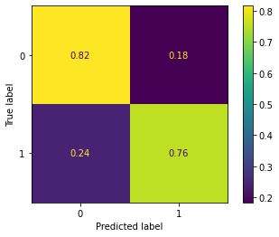
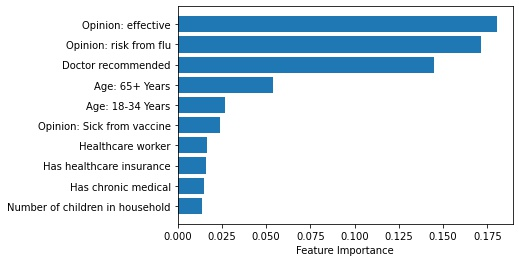

# Predicting Seasonal Influenza Vaccinations
Predicting vaccination status using National 2009 H1N1 Flu Survey

**Author**: Greg Burgess

## Overview

An average of [34,200 people](https://www.cdc.gov/flu/about/burden/index.html) die each year from seasonal flu in the US alone. The primary goal of this project is to predict whether people will receive their seasonal influenza vaccination based on information about demographics, beliefs and opinions, and health behaviors. Using machine learning classifiers (logistic regression and random forest), I identified the most important features influencing vaccination status. The model suggests specific steps that public health agencies could take to increase vaccination rates and allocate healthcare resources.


## Business Problem


[Between 2010 and 2020], hospitalizations due to seasonal flu ranged between 140,000 and 710,000 per year, and deaths ranged between 12,000 and 52,000 per year. Increasing the number of people who receive the seasonal flu vaccination each year can [reduce deaths, hospitalizations, and illnesses](https://www.cdc.gov/flu/vaccines-work/past-burden-averted-est.html).

In the US, numerous government agencies established to provide guidance and advice to the public to reduce communicable diseases, and resources to provide vaccinations to prevent and mitigate those diseases. Using machine learning can improve the ability of these agencies to accomplish these goals to keep our communities safe and healthy.

Predicting who will receive vaccines can help determine how much vaccine is needed, and where to send those vaccine stocks. Predicting who will not receive vaccines can help prepare healthcare systems for increased hospitalization during the flu season. Lastly, identifying factors that influence vaccination can help public health agencies better understand vaccine hesitancy and target interventions to improve vaccination rates.

## Data
**Before running these notebooks, you must download data from the [DrivenData Flu Shot Learning](https://www.drivendata.org/competitions/66/flu-shot-learning/page/210/) competition, and place those csv files into the `data/` directory**

Data for this project was downloaded from the [DrivenData Flu Shot Learning](https://www.drivendata.org/competitions/66/flu-shot-learning/page/210/) competition, which came in turn from the National 2009 H1N1 Flu Survey (NHFS). The NHFS was sponsored by the National Center for Immunization and Respiratory Diseases (NCIRD) and conducted jointly by NCIRD and the National Center for Health Statistics (NCHS), Centers for Disease Control and Prevention (CDC). The NHFS was a list-assisted random-digit-dialing telephone survey of households, designed to monitor influenza immunization coverage in the 2009-10 season. (additional info [here](https://webarchive.loc.gov/all/20140511031000/http://www.cdc.gov/nchs/nis/about_nis.htm#h1n1) and [here](ftp://ftp.cdc.gov/pub/Health_Statistics/NCHS/Datasets/nis/nhfs/nhfspuf_readme.txt) ).

The [features](https://www.drivendata.org/competitions/66/flu-shot-learning/page/211/) provided by DrivenData covered a number of categories, including demographic information, beliefs and opinions, and health behaviors. The provide target variables were `h1n1_vaccine` (whether respondent received H1N1 flu vaccine) and `seasonal_vaccine` (whether respondent received seasonal flu vaccine). For this project, I used only `seasonal_vaccine`.


## Methods

There were three columns (`health_insurance`, `employment_industry`, `employment_occupation`) with a substantial amount of missing data. These were addressed specifically to avoid losing these observations (see [EDA Notebook](./01_eda_notebook.ipynb) for more details).

I tested the predictive ability of two machine learning algorithms: logistic regression and random forest classifiers. A train-test split was conducted on the data prior to training any model. For both types of models, I trained a baseline version of the model using default hyperparameters, and validated the performance of that model using k-fold cross validation. Subsequently, I conducted an iterative grid search cross-validation to tune hyperparameters and maximize performance involving that algorithm.

The business problem requires that I maximize accuracy for true positives (correctly predicting people who do receive vaccines) and true negatives (correctly predicting people who forego vaccines). Therfore, I utilized ([ROC-AUC](https://scikit-learn.org/stable/modules/generated/sklearn.metrics.roc_auc_score.html)) as an evaluation metric, to ensure my model maximizes the ability to separate true positives and true negatives.

The final model was used to identify the feature importance of the variables in the model, and the most important features were used to guide recommendations to the stakeholder.


## Results

The current iteration of the machine learning model is able to identify 76% of people receiving vaccines, which can help better allocate vaccination resources where there is demand. The model also identified 82% of non-vaccinators, which can help public health agencies target interventions to increase vaccination in those groups.



There were several factors that influenced people's willingness to receive seasonal flu vaccinations. The primary factors included whether people felt the vaccine was effective, whether they were worried about getting flu, and whether their primary care doctor recommended the vaccine. Other factors included whether people were worried about getting sick from the vaccine, their age, whether they have health insurance, chronic medical conditions, and number of children in their household.




## Recommendations

- To increase vaccination rates:
	- Promote benefits of vaccination
	- Encourage healthcare providers to promote vaccination
	- Address societal roadblocks to vaccination (e.g., sick leave, heath insurance)

- To better allocate vaccination resources:
	- Distribute vaccinations at primary care providers
	- Target vulnerable groups (older adults, chronic illness)
	- Provide free vaccination opportunities for young and low-income adults

## Next steps

In the future, I would hope to improve predictive modeling by:
- Create separate models for different demographics and regional populations
- Improving model performance with ensemble algorithms
- Utilizing more detailed data (such as PHI / PII) to better inform decisions


## For More Information

Please review my [Presentation](./Presentation.pdf) and, for full analysis, review the Jupyter Notebooks included in the repository
1. [EDA Notebook](./01_eda_notebook.ipynb)
2. [Pipelines and Modeling Notebook](./02_model_pipelines.ipynb)

For any additional questions, please [email](mailto:gcburgess@gmail.com) or connect via [LinkedIn](https://www.linkedin.com/in/Greg-Burgess).


## Repository Structure

Describe the structure of your repository and its contents, for example:

```
├── README.md                           <- The top-level README for reviewers of this project
├── Presentation.pdf                    <- PDF version of project presentation
├── 01_eda_notebook.ipynb   		<- First Jupyter notebook: Includes data understanding and exploratory data analysis (EDA)
├── 02_model_pipelines.ipynb   		<- Second Jupyter notebook: Includes data understanding 
├── data                                <- Directory to store data downloaded from DrivenData.com
└── images                              <- Images generated from code and collected from external sources
```
